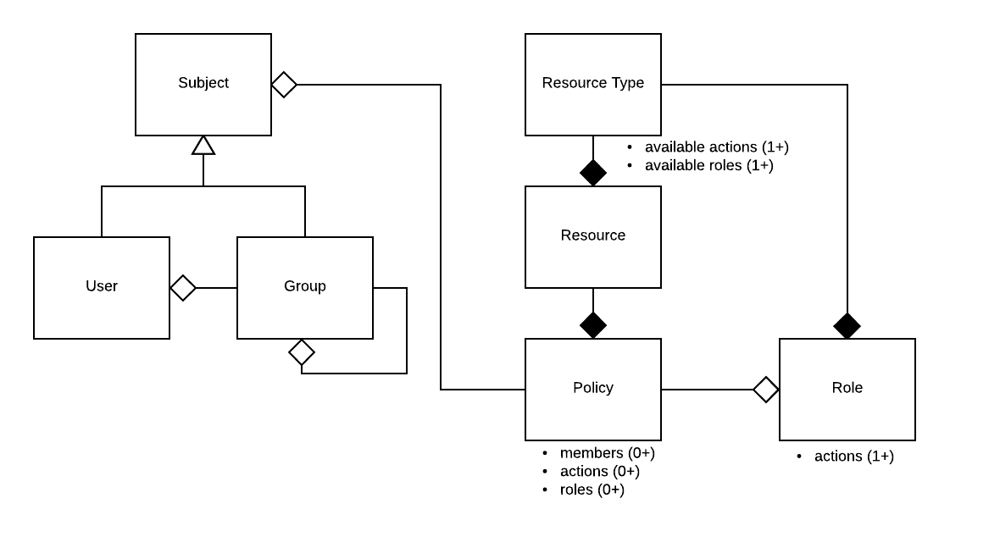

# Sam - Identity and Access Management (IAM)


## In a nutshell
The crux of IAM in Sam is a policy. A policy says **who** can **do what** to a **thing**. More technically the who is called a **subject** and can be a user or a group of users, the do what is called an **action** such as read or update, and the thing is called a **resource** such as a workspace or project. Resources have types which specify what actions are available for its resources, roles (which are collections of actions) and which role is the "owner" role. The "owner" role should have the appropriate actions to administer a resource. When a resource is created a policy with the owner role is automatically created and the creator is added.

Here is a pretty picture showing what is described above


Once a resource is created one can
* create new named policies which may contain subjects, any actions that are valid for the resource type, and/or any roles that are valid for the resource type
* list policies
* alter policies
* delete policies
* ask if one has access to execute an action

Also one can list all accessible resources of a type and associated policies.

## To build 
Make sure git secrets is installed:
```$xslt
brew install git-secrets
```
Ensure git-secrets is run:
<i>If you use the rsync script to run locally you can skip this step</i>
```$xslt
cp -r hooks/ .git/hooks/
chmod 755 .git/hooks/apply-git-secrets.sh
```
Build jar:
```
./docker/build.sh jar
```

Build jar and docker image:
```
./docker/build.sh jar -d build
```

## To run unit tests
Spin up a local OpenDJ:
```
sh docker/run-opendj.sh start
```

Make sure your `SBT_OPTS` are set:
```
export SBT_OPTS="-Ddirectory.url=ldap://localhost:3389 -Ddirectory.password=testtesttest"
```

Run tests:
```
sbt test
```
Stop your local opendj:
```
sh docker/run-opendj.sh stop
```